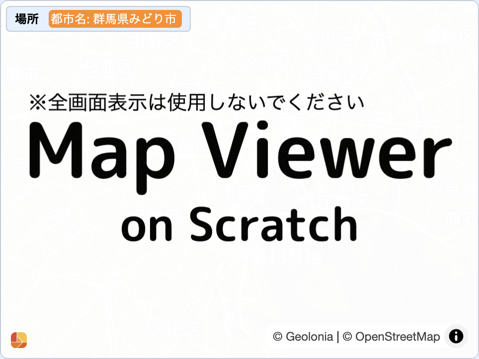

## 作品名
Map Viewer on Scratch

## 作者
飯田（仮名）

## プログラムデータ
以下のリンクをクリックするとダウンロードされます。

[Map Viewer on Scratch](https://github.com/nara-coderdojo/gallery/raw/main/stretch3/Map_Viewer_on_Scratch/Map_Viewer_on_Scratch.sb3)

## 利用ツール
[Stretch3](https://stretch3.github.io/)

## 作品説明
[Stretch3](https://stretch3.github.io/)の新機能、「Geo Scratch」を作ってシンプルなマップビュアーを作ってみました。

簡単に操作できて、拡大、移動、指定した場所に移動、場所を表示などができます。

画面に最低限のもの(ヘルプボタン)しか置いていないので画面も大きくて見やすいです。

「Geo Scrach」で「こんなものが作れるのだなー」みたいな例として見てもらえると嬉しいです。
自由にお使いください。 

